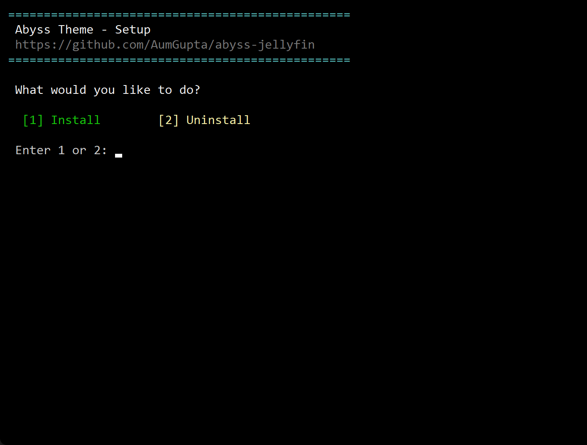
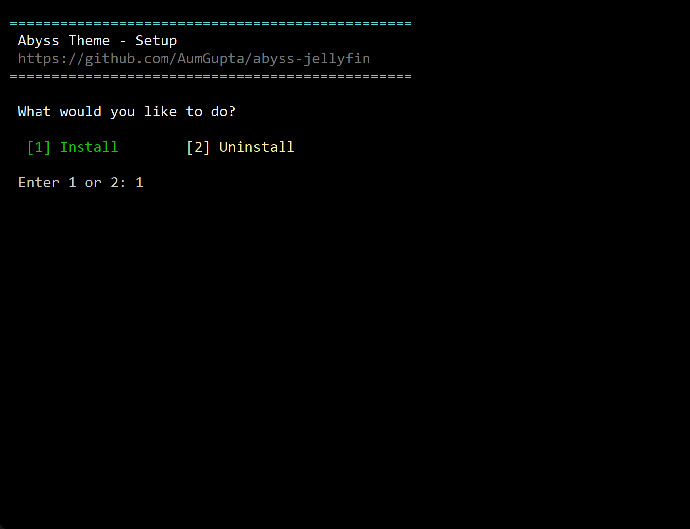
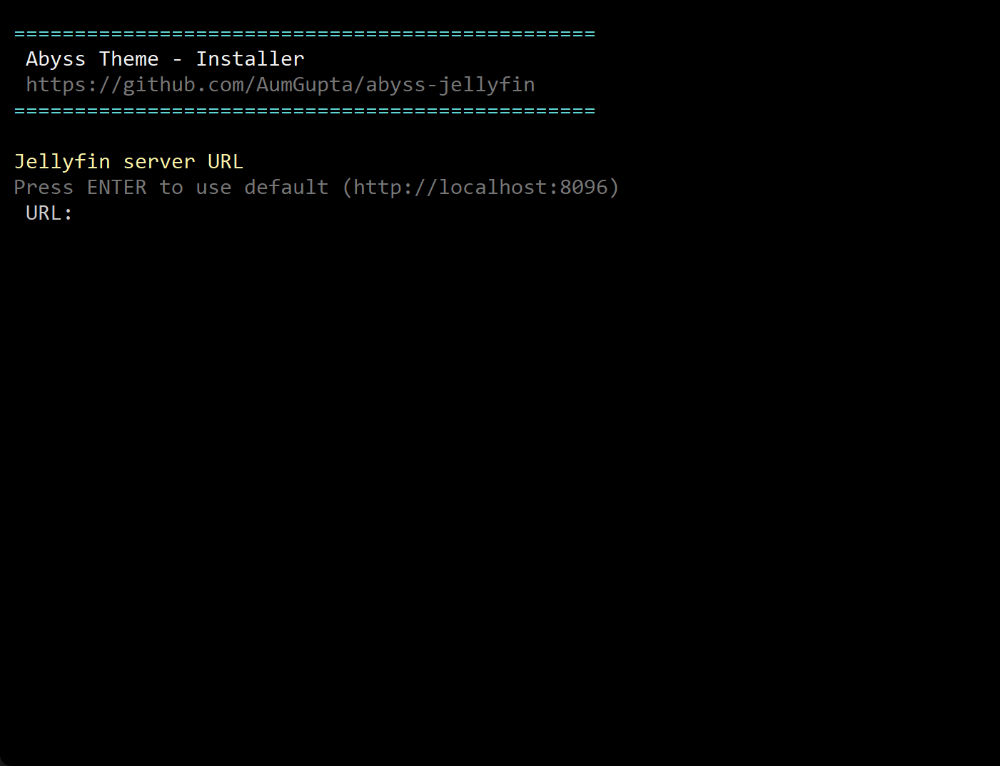
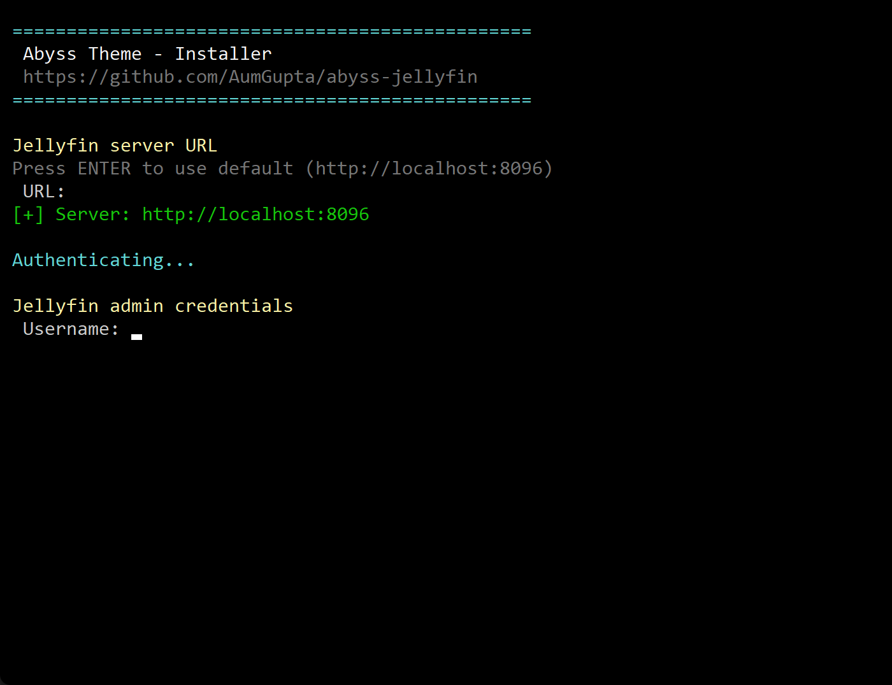
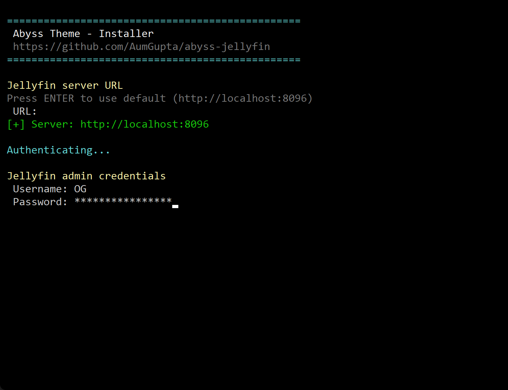
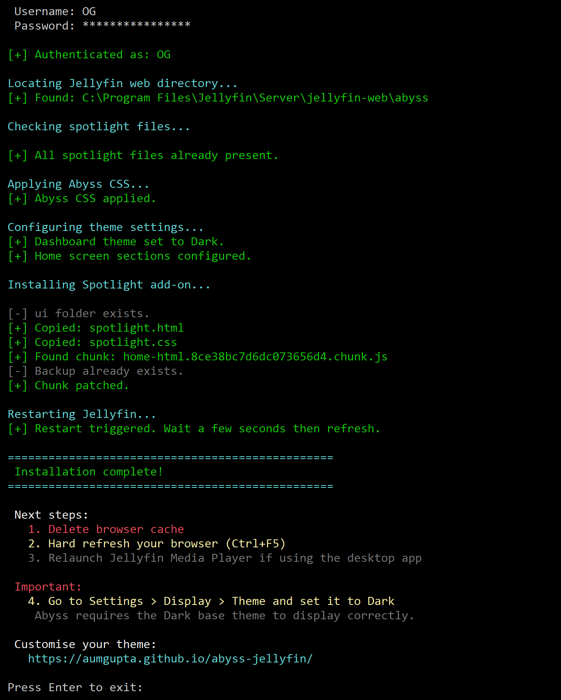
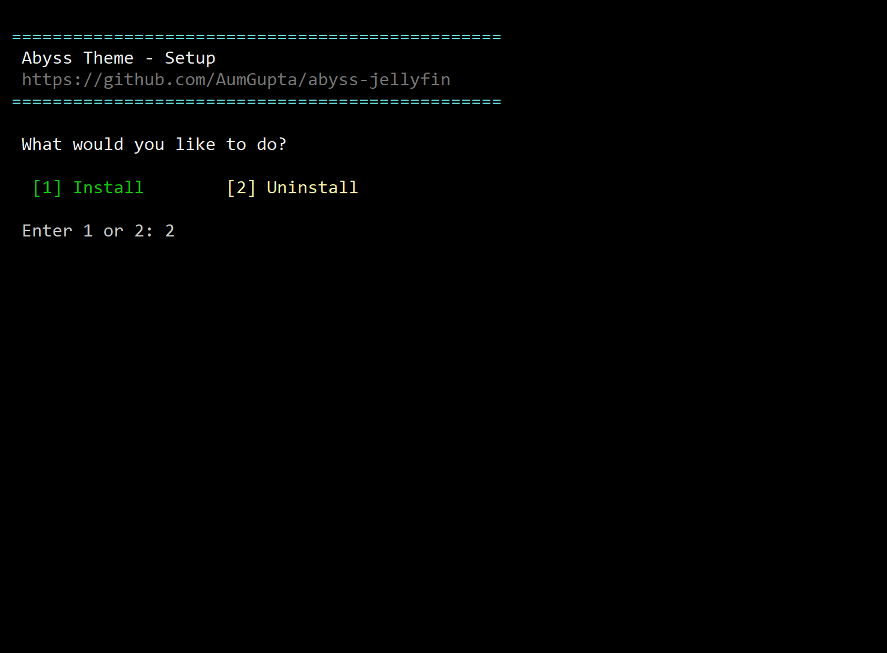
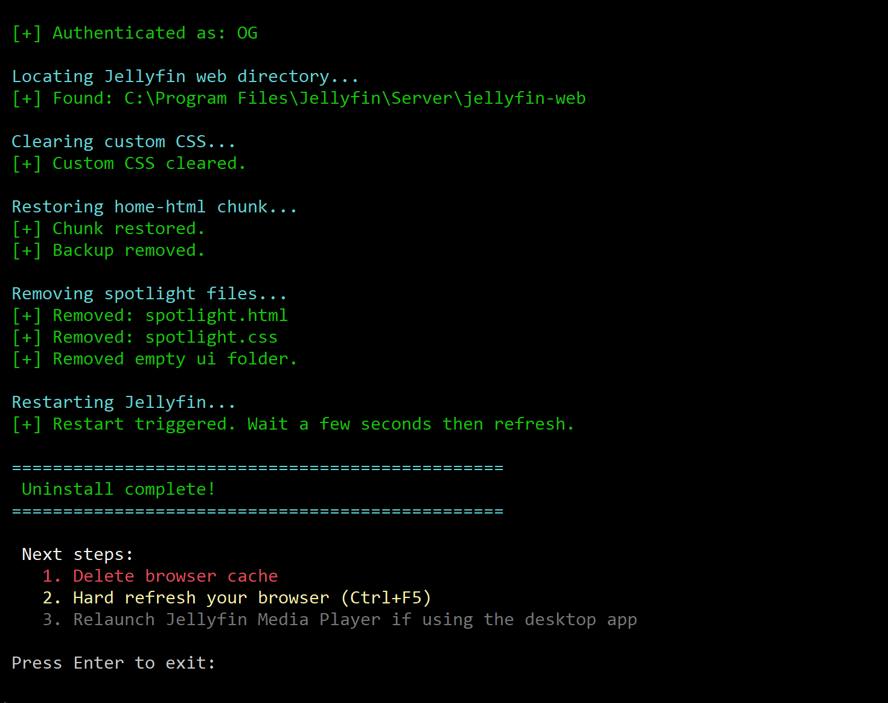

# Setup Guide

Download the latest **`abyss-setup-vX.X.X.exe`** from the [Releases](https://github.com/AumGupta/abyss-jellyfin/releases/latest) page and run it, a command prompt screen will pop up:

> 

## 1. Installation

1. Type `1` and press `ENTER`.
> 

2. Press `ENTER` to default to server url as `localhost:8096` or type server URL.
> 
>
> [!NOTE]
> As of now the setup works on the same machine as your server.

3. Enter your Jellyfin admin username and password (you get 3 tries for typing the correct password).
> 

5. **DONE**. Your final screen should look like this, make sure you follow the `Next steps` shown on your screen at the end of setup.
> 

***

<h2>Uninstallation</h2>

1. Type `2` and press `ENTER`.
> 

2. Follow steps **2** and **3** of Installation section 

3. **DONE**. Your final screen should look like this, make sure you follow the `Next steps` shown on your screen at the end of setup.
> 

